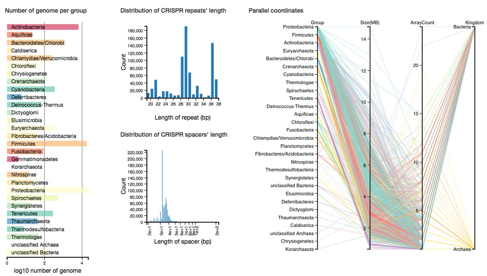

# Dataviz

This component of the project was aimed at developing a visualisation of our dataset. The code has been integrated in the django web application, but can be tested locally from this folder.

From python 2:
```python
$ python -m SimpleHTTPServer
```

Or python 3:
```python
$ python -m http.server
```

Then navigate with your browser to http://localhost:8000/dataviz.html

**Preview**


